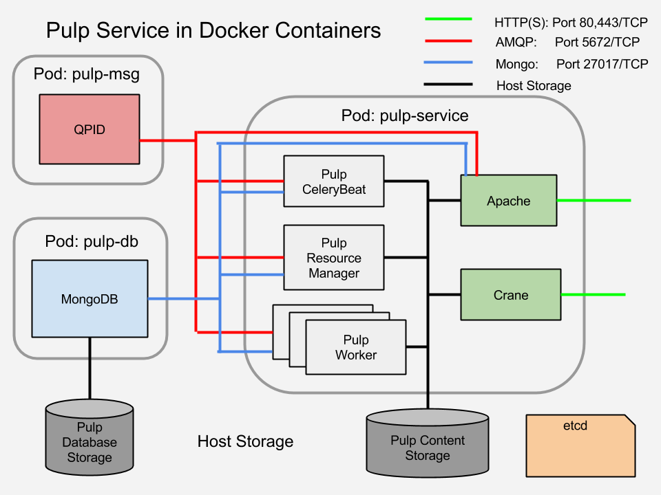

Pulp Docker Registry Quickstart Guide
=====================================

Pulp 2.4 supports docker content and can serve as a docker registry.

Why Pulp As a Docker Registry?
------------------------------
Pulp provides the following:

* Separation of administrator interfaces (pulp backend client and API) and end-user interface
* Role-based access control (RBAC) with LDAP support
* Ability to push content to public-facing servers while keeping the management interface behind a firewall
* Synchronization of content accross an organization using `nodes <https://pulp-user-guide.readthedocs.org/en/latest/nodes.html>`_.
* `Well-documented API <https://pulp-dev-guide.readthedocs.org/en/latest/integration/rest-api/index.html>`_
* `Event-based notifications <https://pulp-dev-guide.readthedocs.org/en/latest/integration/events/index.html>`_ (http/amqp/email) enables CI workflows and viewing history
* Service-oriented architecture (SOA) that enables scaling

Components
----------

.. FIXME: make this a table?
+----------------------------------+-----------------------------------------------------------------------------------------------------------------------------------------------------------------+
|* Pulp server                     | (2.4 beta)                                                                                                                                                      |
+----------------------------------+-----------------------------------------------------------------------------------------------------------------------------------------------------------------+
|* Pulp admin client               | <https://registry.hub.docker.com/u/aweiteka/pulp-admin/>_: remote management client                                                                             |
+----------------------------------+-----------------------------------------------------------------------------------------------------------------------------------------------------------------+
|* pulp_docker plugin              | <https://github.com/pulp/pulp_docker>_ (unreleased): supports docker content type                                                                               |
+----------------------------------+-----------------------------------------------------------------------------------------------------------------------------------------------------------------+
|* Crane                           | <https://github.com/pulp/crane>_ (unreleased): partial implementation of the `docker registry protocol <https://docs.docker.com/reference/api/registry_api/>_   |
+----------------------------------+-----------------------------------------------------------------------------------------------------------------------------------------------------------------+
|* additional tooling (unreleased):| build on Pulp admin client, provides streamlined publishing workflow                                                                                            |
+----------------------------------+-----------------------------------------------------------------------------------------------------------------------------------------------------------------+

Deployment Options
------------------
There are two options for the deployment of Pulp as a Docker Registry:

1. Pulp as a VM, with Crane as a Docker Container
2. A multi-container environment

This document focuses on the multi-container environment.

Installation
------------

Server
^^^^^^

**Host Configuration**

1) Make sure that the docker daemon is running::

        sudo systemctl status docker

2) Open the following ports to incoming traffic:

* TCP port 80 (HTTP)
* 443 (HTTPS)
* 5672 (QPID)
* 27017 (MongoDB) 

::
        sudo firewall-cmd --permanent --add-service http
        sudo firewall-cmd --permanent --add-service https
        sudo firewall-cmd --permanent --add-port 27017/tcp
        sudo firewall-cmd --permanent --add-port 5672/tcp
        sudo firewall-cmd --reload

**Server Installation**

The Pulp server is packaged as a multi-container environment. It is a basic "all-in-one" deployment that requires the containers to run on the same VM or bare metal host.

1) Pull the images::

        IMAGES=( "aweiteka/pulp-crane-allinone" \
                 "aweiteka/pulp-worker" \
                 "aweiteka/pulp-qpid" \
                 "aweiteka/pulp-mongodb" \
                 "aweiteka/pulp-apache" \
                 "aweiteka/pulp-data" \
                 "aweiteka/pulp-centosbase" )
        for i in "${IMAGES[@]}"; do sudo docker pull $i; done

2) View the images::

        $ sudo docker images
        REPOSITORY                     TAG                 IMAGE ID            CREATED             VIRTUAL SIZE
        aweiteka/pulp-qpid             latest              d75a98181734        26 hours ago        405.3 MB
        aweiteka/pulp-worker           latest              98faa0164705        26 hours ago        680.8 MB
        aweiteka/pulp-mongodb          latest              e9531cd0f08b        27 hours ago        293.1 MB
        aweiteka/pulp-data             latest              2c439bcd2872        27 hours ago        604.8 MB
        aweiteka/pulp-apache           latest              367c5f169f1d        28 hours ago        683 MB
        aweiteka/pulp-centosbase       latest              e2889f4dca42        4 days ago          604.8 MB
        aweiteka/pulp-crane-allinone   latest              b81c502f6703        11 days ago         442.7 MB

3) Download the orchestration script and run::

        curl -O https://raw.githubusercontent.com/aweiteka/pulp-dockerfiles/master/centos/orchestrate.sh
        sudo bash orchestrate.sh aweiteka

4) View all running and stopped containers::

        $ sudo docker ps -a
        CONTAINER ID        IMAGE                                 COMMAND                CREATED             STATUS         PORTS                           NAMES
        38feb71f7691        aweiteka/pulp-crane-allinone:latest   /usr/sbin/httpd -D F   34 seconds ago      Up 33 seconds  0.0.0.0:80->80/tcp              pulp-crane              
        9b025d72ee94        aweiteka/pulp-worker:latest           /run.sh resource_man   34 seconds ago      Up 34 seconds                                  pulp-resource_manager   
        b7c3f923a0f7        aweiteka/pulp-worker:latest           /run.sh beat           35 seconds ago      Up 34 seconds                                  pulp-beat               
        298ade639edc        aweiteka/pulp-worker:latest           /run.sh worker 2       35 seconds ago      Up 35 seconds                                  pulp-worker2            
        ccab34aa1d61        aweiteka/pulp-worker:latest           /run.sh worker 1       36 seconds ago      Up 35 seconds                                  pulp-worker1            
        b89ae83e1cbe        aweiteka/pulp-apache:latest           /run.sh                38 seconds ago      Up 36 seconds  0.0.0.0:443->443/tcp, 0.0.0.0:8080->80/tcp   pulp-apache             
        77fcc121b0a5        aweiteka/pulp-qpid:latest             qpidd -t --auth=no     39 seconds ago      Up 38 seconds  0.0.0.0:5672->5672/tcp          pulp-qpid               
        80d80664abfd        aweiteka/pulp-mongodb:latest          /usr/bin/mongod --qu   39 seconds ago      Up 39 seconds  0.0.0.0:27017->27017/tcp        pulp-mongodb            
        137fbd04c73a        aweiteka/pulp-data:latest             /run.sh                40 seconds ago      Exited (0) 39 seconds ago                      pulp-data       

.. note::

   The pulp-data container exits immediately. It is a dependent volume container referenced by
   ``--volumes-from``. It persist as a shared volume while the other containers are running.

Remote Client Tools
^^^^^^^^^^^^^^^^^^^

The ``pulp-admin`` client may be `installed as an RPM <installation>`_ or run as a container. To run as a container an alias is created for the ``docker run`` command. The ``ENTRYPOINT`` for the container is the ``pulp-admin`` executable, enabling the user to pass commands to the alias as arguments. For example::

       $ pulp-admin <pulp admin arguments>

The ``pulp-publish-docker`` utility is an initial prototype to automate pushing docker images to the Pulp registry. It is based on the pulp-admin client.

**Setup**

1) Create the ``~/.pulp`` client configuration directory and update the SELinux context::

        mkdir ~/.pulp
        chcon -Rvt svirt_sandbox_file_t ~/.pulp

2) Create file ``~/.pulp/admin.conf`` and pulp server hostname::

        [server]
        host = pulp-server.example.com

3) Pull the images::

        sudo docker pull aweiteka/pulp-admin
        sudo docker pull aweiteka/pulp-publish-docker

4) Create aliases for ``pulp-admin`` and ``pulp-publish-docker``. For persistence, update your ``~/.bashrc`` file with the line below and run ``source ~/.bashrc``::

        alias pulp-admin="sudo docker run --rm -t -v ~/.pulp:/.pulp -v /tmp/docker_uploads/:/tmp/docker_uploads/ aweiteka/pulp-admin"
        alias pulp-publish-docker="sudo docker run --rm -i -t -v ~/.pulp:/.pulp -v /tmp/docker_uploads/:/tmp/docker_uploads/ aweiteka/pulp-publish-docker"

.. note::

   A new container is created each time the pulp-admin runs. The ``--rm`` removes the ephemeral
   container after exiting. This adds a few seconds to execution and is optional.

4) Login using the remote pulp-admin client. Default username is "admin". Default password is "admin"::

        pulp-admin login -u admin -p admin

A certificate is downloaded and used on subsequent commands so credentials do not need to be passed in for each command.

Pulp Service Structure in Docker with Kubernetes
------------------------------------------------

Publishing Docker Images
------------------------

The ``pulp-publish-docker`` utility automates the steps necessary to do the following:

* create a docker repository in Pulp
* upload images to the docker repository in Pulp 
* publish the repository

Usage output::

        $ pulp-publish-docker --help
        Usage:
            Upload (2 methods): will create repo if needed, optional publish
              STDIN from "docker save"
              docker save <repo> | ./pulp_docker_util.py --repo <repo> [OPTIONS]

              from previously saved tar file
              ./pulp_docker_util.py --repo <repo> -f </full/path/to/image.tar> [OPTIONS]

            Create repo only (do not upload or publish):
            ./pulp_docker_util.py --repo <repo> [OPTIONS]

            Publish existing repo:
            ./pulp_docker_util.py --repo <repo> --publish

            List repos:
            ./pulp_docker_util.py --list

        Options:
          --version             show program's version number and exit
          -h, --help            show this help message and exit
          -i ID, --id=ID        Pulp repository ID, required for most pulp commands.
                                Only alphanumeric, ., -, and _ allowed
          -r REPO, --repo=REPO  Docker repository name for 'docker pull <my/registry>'.
                                If not specified the Pulp ID will be used
          -d DESCRIPTION, --description=DESCRIPTION
                                Pulp repository description
          -n DISPLAY_NAME, --name=DISPLAY_NAME
                                Pulp repository display name
          -u URL, --url=URL     The URL that will be used when generating the
                                redirect. Defaults to pulp server,
                                https://<pulp_server>/pulp/docker/<repo_id>
          -f FILENAME, --file=FILENAME
                                Full path to image tarball for upload
          -p, --publish         Publish repository. May be added to image upload or
                                used alone.
          -l, --list            List repositories. Used alone.

Example publish command::

        $ docker save my/app | pulp-publish-docker --id app --repo my/app --publish
        Repository [app] successfully created

        +----------------------------------------------------------------------+
                                      Unit Upload
        +----------------------------------------------------------------------+

        Extracting necessary metadata for each request...
        [==================================================] 100%
        Analyzing: test.tar
        ... completed

        Creating upload requests on the server...
        [==================================================] 100%
        Initializing: test.tar
        ... completed

        Starting upload of selected units. If this process is stopped through ctrl+c,
        the uploads will be paused and may be resumed later using the resume command or
        cancelled entirely using the cancel command.

        Uploading: test.tar
        [==================================================] 100%
        18944/18944 bytes
        ... completed

        Importing into the repository...
        This command may be exited via ctrl+c without affecting the request.

        [\]
        Running...

        Task Succeeded

        Deleting the upload request...
        ... completed

        +----------------------------------------------------------------------+
                              Publishing Repository [true]
        +----------------------------------------------------------------------+

        This command may be exited via ctrl+c without affecting the request.

        Publishing Image Files.
        [==================================================] 100%
        3 of 3 items
        ... completed

        Making files available via web.
        [-]
        ... completed

        Task Succeeded

Repository and server management
--------------------------------

The ``pulp-admin`` client is required to manage the pulp server.

Roles
^^^^^

Create roles::

        pulp-admin auth role create --role-id contributors --description "content contributors"
        pulp-admin auth role create --role-id repo_admin --description "Repository management"

Permissions
^^^^^^^^^^^

Permissions may be assigned to roles to control access. See `API documentation <https://pulp-dev-guide.readthedocs.org/en/latest/integration/rest-api/index.html>`_ for paths to resources.

.. FIXME: research all the necessary permissiong for roles: admins can do everything except user mgmt; contribs cannot delete repos or do any user mgmt
Here we create permissions for the "contributors" role so they can create repositories and upload content but cannot delete repositories::

        pulp-admin auth permission grant --role-id contributors --resource /repositories -o create -o read -o update -o execute
        pulp-admin auth permission grant --role-id repo_admin --resource /repositories -o create -o read -o update -o execute

Users
^^^^^

Users may be manually created. Alternatively the Pulp server may be connected to an LDAP server. See `authentication` for configuration instructions.

Create a contributor user. You will be prompted for a password::

        pulp-admin auth user create --login jdev --name "Joe Developer"
        Enter password for user [jdev] : **********
        Re-enter password for user [jdev]: **********
        User [jdev] successfully created

Create a repository admin user. You will be prompted for a password::

        pulp-admin auth user create --login madmin --name "Mary Admin"

Assign user to role::

        pulp-admin auth role user add --role-id contributors --login jdev
        pulp-admin auth role user add --role-id repo_admin --login madmin

Test permission assignments.

1) Logout as "admin" user::

        pulp-admin logout

2) Login as "jdev" user::

        pulp-admin login -u jdev

3) Ensure "Joe Developer" can create, upload and publish a repository. Ensure that "Joe Developer" cannot delete repositories or manage users.

.. note::

   Users that require access to all pulp administrative commands should be assigned the "super-users" role.

Manage Repositories
^^^^^^^^^^^^^^^^^^^

Groups
++++++

Create repository group::

        pulp-admin repo group create --group-id baseos --description "base OS docker images"

Assign repository to group::

        pulp-admin repo group members add --group-id=baseos --repo-id centos

Metadata
++++++++

Repositories and repository groups may have notes or key:value pair metadata added. Here we add an "environment" note to a repository::

        pulp-admin docker repo update --repo-id centos --note environment=test

Copy
++++

Images may be copied into other repositories for image lifecycle management. Images are not duplicated. Only the metadata references to the images are changed. In other words, copying a repository is an inexpensive operation.

1) Create a new repository::

        pulp-admin docker repo create --repo-id centos-prod --note environment=prod

2) List repository images::

        pulp-admin docker repo images --repo-id centos

.. FIXME: tag matching syntax not working
3) Copy all the images with docker tag "centos7" into the new repository::

        pulp-admin docker repo copy --from-repo-id centos --to-repo-id centos-prod --match='tag=centos7'

Troubleshooting
---------------

See `Troubleshooting Guide <troubleshooting>`_

**Error: Cannot start container <container_id>: port has already been allocated**

If docker returns this error but there are no running containers allocating conflicting ports docker may need to be restarted.::

        sudo systemctl restart docker

**Stale pulp-admin containers**

The ``--rm`` in the pulp-admin alias should remove every pulp-admin container after it stops. However if the container exits prematurely or there is an error the container may not be removed. This command removes all stopped containers::

        sudo docker rm $(docker ps -a -q)

Logging
^^^^^^^

Apache and the pulp workers log to journald. From the container host use ``journalctl``::

        sudo journalctl SYSLOG_IDENTIFIER=pulp + SYSLOG_IDENTIFIER=celery + SYSLOG_IDENTIFIER=httpd

About
-----

* Based on centos image
* Includes pulp beta repository v2.4
* Includes pulp_docker plugin

View `Dockerfile Source <https://github.com/aweiteka/pulp-dockerfiles>`_
