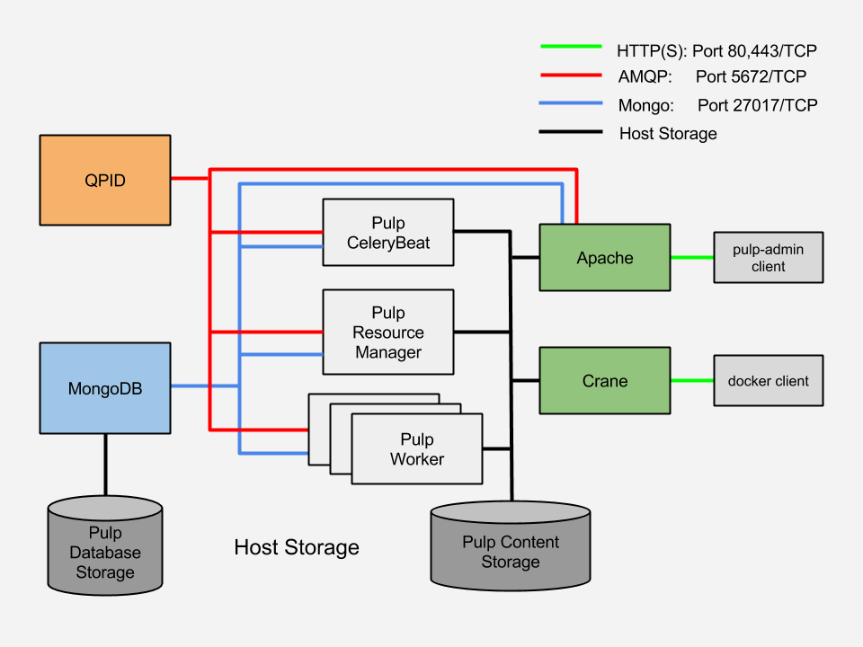

Pulp Docker Registry Quickstart Guide
=====================================

This document explains how to use Pulp as a Docker registry. Its intended audience is Independent Software Vendors and Enterprise users who want to use Pulp as a Docker registry.

Pulp is a platform for managing repositories of content. Pulp makes it possible to locally mirror either all of or part of a repository. Pulp makes it possible to host content in new repositories, and makes it possible to manage content from multiple sources in a single place.

Pulp 2.4 supports docker content and can serve as a docker registry.

Why Pulp As a Docker Registry?
------------------------------
Pulp provides the following:

* Separation of administrator interface (pulp API) and end-user interface (docker)
* Role-based access control (RBAC) with LDAP support
* Synchronization of content accross an organization using `nodes <https://pulp-user-guide.readthedocs.org/en/latest/nodes.html>`_.
* `Well-documented API <https://pulp-dev-guide.readthedocs.org/en/latest/integration/rest-api/index.html>`_
* `Event-based notifications <https://pulp-dev-guide.readthedocs.org/en/latest/integration/events/index.html>`_ (http/amqp/email), that enable CI workflows and viewing history
* Service-oriented architecture (SOA) that enables scaling

Components
----------

+----------------------------------+-----------------------------------------------------------------------------------------------------------------------------------------------------------------+
| pulp server                      | version 2.4 or greater. Includes a web server, mongo database and messaging broker                                                                              |
+----------------------------------+-----------------------------------------------------------------------------------------------------------------------------------------------------------------+
| Pulp admin client                | remote management client, available as a `docker container <https://registry.hub.docker.com/u/aweiteka/pulp-admin/>`_                                           |
+----------------------------------+-----------------------------------------------------------------------------------------------------------------------------------------------------------------+
| pulp_docker plugin               | adds support for docker content type (`unreleased <https://github.com/pulp/pulp_docker>`_)                                                                      |
+----------------------------------+-----------------------------------------------------------------------------------------------------------------------------------------------------------------+
| Crane                            | partial implementation of the `docker registry protocol <https://docs.docker.com/reference/api/registry_api/>`_ (`unreleased <https://github.com/pulp/crane>`_) |
+----------------------------------+-----------------------------------------------------------------------------------------------------------------------------------------------------------------+
| pulp-publish-docker              | prototype tooling based on pulp-admin client providing streamlined publishing workflow                                                                          |
+----------------------------------+-----------------------------------------------------------------------------------------------------------------------------------------------------------------+

Pulp packaged as a set of Docker images is based on the CentOS 7 image.

Click here to access the repository containing Dockerfiles for Pulp: `Dockerfile Source <https://github.com/aweiteka/pulp-dockerfiles>`_

Pulp Service Architecture
-------------------------

The Pulp Service Architecture is a multi-service application composed of an Apache web server, MongoDB and QPID for messaging. Tasks are performed using a Celery distributed task queue. Workers can be added to scale the architecture. Administrative commands are performed remotely using the pulp-admin client.

The above figure details the deployment of the Pulp Service architecture.

+---------------+-----------------------------------------------------------------------------------------------------------------------------------------------------------------------------------+
|  Component    |  Role                                                                                                                                                                             |
+---------------+-----------------------------------------------------------------------------------------------------------------------------------------------------------------------------------+
| Apache        | Web server application (Pulp API) and serves files (RPMs, Docker images, etc). It responds to pulp-admin requests.                                                                |
+---------------+-----------------------------------------------------------------------------------------------------------------------------------------------------------------------------------+
| MongoDB       | Stores data.                                                                                                                                                                      |
+---------------+-----------------------------------------------------------------------------------------------------------------------------------------------------------------------------------+
| Crane         | An Apache server that responds to Docker Registry API calls. Crane implements the Docker Registry Protocol.                                                                       |
+---------------+-----------------------------------------------------------------------------------------------------------------------------------------------------------------------------------+
| QPID          | The open-source messaging system that implements Apache Message Queuing Protocol (AMQP). Passes messages from Apache to CeleryBeat and the Pulp Resource Manager.                 |
+---------------+-----------------------------------------------------------------------------------------------------------------------------------------------------------------------------------+
| Celery Beat   | Controls the task queue. `Explanation of Celery <https://fedorahosted.org/pulp/wiki/celery>`_                                                                                     |
+---------------+-----------------------------------------------------------------------------------------------------------------------------------------------------------------------------------+

Deployment Options
------------------
Pulp can be deployed as a Docker registry in two different ways:

1. `Pulp as a VM, with Crane as a Docker Container <https://pulp-user-guide.readthedocs.org/en/latest/installation.html>`_
2. A multi-container environment

This document focuses on the setup and configuration of the multi-container environment.

+----------------------------------------------------------------+
| **NOTE**                                                       |
| If you prefer a more traditional virtual-machine-based         |
| installation, follow the instructions linked to above, in the  |
| link indicated by the words "Pulp as a VM, with Crane as a     |
| Docker Container".                                             |
+----------------------------------------------------------------+

Installation
------------

Requirements
^^^^^^^^^^^^
* Disk: TBD
* DNS: The pulp server must have a resolvable hostname for the pulp-admin and docker remote clients to interact with it.

+----------------------------------------------------------------+
| **NOTE**                                                       |
| The container-ized version of the Pulp server creates self-    |
| signed SSL certificates during run-time. Providing a           |
| configuration option to use an organization's certificates is  |
| a known issue.                                                 |
+----------------------------------------------------------------+

Server
^^^^^^

**Host Configuration**

1) Ensure the docker daemon is running and configured to run on startup

2) Open the following TCP ports to incoming traffic.

* 80 (HTTP)
* 443 (HTTPS)
* 5672 (QPID)
* 27017 (MongoDB)

Example commands using iptables::

        $ iptables -I INPUT -p tcp --dport 27017 -j ACCEPT
        $ iptables -I INPUT -p tcp --dport 80 -j ACCEPT
        $ iptables -I INPUT -p tcp --dport 443 -j ACCEPT
        $ iptables -I INPUT -p tcp --dport 5672 -j ACCEPT

**Server Installation**

The Pulp server is packaged as a multi-container environment. It is a basic "all-in-one" deployment that requires the containers to run on the same VM or bare metal host.

1) Download the installer::

        $ curl -O https://raw.githubusercontent.com/aweiteka/pulp-dockerfiles/master/centos/install_pulp_server.sh

2) Run the installer::

        $ sudo bash install_pulp_server.sh <host_ip_address>

3) View the images::

        $ sudo docker images

        REPOSITORY                     TAG                 IMAGE ID            CREATED             VIRTUAL SIZE
        aweiteka/pulp-qpid             latest              d75a98181734        26 hours ago        405.3 MB
        aweiteka/pulp-worker           latest              98faa0164705        26 hours ago        680.8 MB
        aweiteka/pulp-mongodb          latest              e9531cd0f08b        27 hours ago        293.1 MB
        aweiteka/pulp-data             latest              2c439bcd2872        27 hours ago        604.8 MB
        aweiteka/pulp-apache           latest              367c5f169f1d        28 hours ago        683 MB
        aweiteka/pulp-centosbase       latest              e2889f4dca42        4 days ago          604.8 MB
        aweiteka/pulp-crane-allinone   latest              b81c502f6703        11 days ago         442.7 MB

4) View all running and stopped containers::

        $ sudo docker ps -a

        CONTAINER ID        IMAGE                                 COMMAND                CREATED             STATUS         PORTS                           NAMES
        38feb71f7691        aweiteka/pulp-crane-allinone:latest   /usr/sbin/httpd -D F   34 seconds ago      Up 33 seconds  0.0.0.0:80->80/tcp              pulp-crane              
        9b025d72ee94        aweiteka/pulp-worker:latest           /run.sh resource_man   34 seconds ago      Up 34 seconds                                  pulp-resource_manager   
        b7c3f923a0f7        aweiteka/pulp-worker:latest           /run.sh beat           35 seconds ago      Up 34 seconds                                  pulp-beat               
        298ade639edc        aweiteka/pulp-worker:latest           /run.sh worker 2       35 seconds ago      Up 35 seconds                                  pulp-worker2            
        ccab34aa1d61        aweiteka/pulp-worker:latest           /run.sh worker 1       36 seconds ago      Up 35 seconds                                  pulp-worker1            
        b89ae83e1cbe        aweiteka/pulp-apache:latest           /run.sh                38 seconds ago      Up 36 seconds  0.0.0.0:443->443/tcp, 0.0.0.0:8080->80/tcp   pulp-apache             
        77fcc121b0a5        aweiteka/pulp-qpid:latest             qpidd -t --auth=no     39 seconds ago      Up 38 seconds  0.0.0.0:5672->5672/tcp          pulp-qpid               
        80d80664abfd        aweiteka/pulp-mongodb:latest          /usr/bin/mongod --qu   39 seconds ago      Up 39 seconds  0.0.0.0:27017->27017/tcp        pulp-mongodb            
        137fbd04c73a        aweiteka/pulp-data:latest             /run.sh                40 seconds ago      Exited (0) 39 seconds ago                      pulp-data       

+----------------------------------------------------------------------------------------------+
| **NOTE**                                                                                     |
|                                                                                              |
| The pulp-data container exits immediately. It is a dependent volume container referenced by  |
| ``--volumes-from``. It persists as a shared volume while the other containers are running.   |
+----------------------------------------------------------------------------------------------+

Remote Client Tools
^^^^^^^^^^^^^^^^^^^

The ``pulp-admin`` client may be `installed as an RPM <installation.rst>`_ or run as a container.

The ``pulp-publish-docker`` utility is a prototype that automates the task of pushing docker images to the Pulp registry. It is based on the ``pulp-admin`` client.

**Setup**

The ``install_client.sh`` script installs the required client components.::

1) Download the install script::

        $ curl -O https://raw.githubusercontent.com/aweiteka/pulp-dockerfiles/master/centos/install_pulp_client.sh

2) Run the install script::

        $ sudo bash install_pulp_client.sh pulp-registry.example.com
        Pulling docker images
        Pulling repository aweiteka/pulp-admin
        8a01d78f4c70: Download complete
        ...
        e013d95b0414: Download complete
        Pulling repository aweiteka/pulp-publish-docker
        7a377a6584f0: Download complete
        ...
        6bb39d1d3ead: Download complete
        Setting up ~/.pulp directory
        changing security context of ‘/home/aweiteka/.pulp’
        Create /run/docker_uploads
        changing security context of ‘/run/docker_uploads’
        Update ~/.bashrc with aliases
        2 aliases created
        Login with command "pulp-admin login -u admin -p admin"

3) using the remote pulp-admin client. In this example, the default username is "admin" and the default password is "admin". If you are not the administrator contact the Pulp administrator for your username and password::

        $ pulp-admin login -u admin -p admin

A certificate is downloaded and used on subsequent commands. Credentials therefore do not need to be passed in for each command.

4) If the administrator, change the default admin password::

        $ pulp-admin auth user update --login admin -p
        Enter new password for user [admin] : ********

+----------------------------------------------------------------------------------------------+
| **NOTE**                                                                                     |
|                                                                                              |
| A new container is created each time the pulp-admin runs. The ``--rm`` flag                  |
| removes the ephemeral container after exiting. This adds a few seconds to execution          |
| and is optional.                                                                             |
+----------------------------------------------------------------------------------------------+

Publishing Docker Images
------------------------

The ``pulp-publish-docker`` utility automates the steps necessary to do the following:

* create a docker repository in Pulp
* upload images to the docker repository in Pulp
* publish the repository

+----------------------------------------------------------------------------------------------+
| **IMPORTANT**                                                                                |
| You must be logged in for the operations described in this section to work properly.         |
| For information on how to log in, see step 3 of the procedure in `Remote Client Tools`_      |
+----------------------------------------------------------------------------------------------+

Upload and publish a docker image::

        $ docker save my/app | pulp-publish-docker --id app --repo my/app --publish
        Repository [app] successfully created

        +----------------------------------------------------------------------+
                                      Unit Upload
        +----------------------------------------------------------------------+

        Extracting necessary metadata for each request...
        [==================================================] 100%
        Analyzing: test.tar
        ... completed

        Creating upload requests on the server...
        [==================================================] 100%
        Initializing: test.tar
        ... completed

        Starting upload of selected units. If this process is stopped through ctrl+c,
        the uploads will be paused and may be resumed later using the resume command or
        cancelled entirely using the cancel command.

        Uploading: test.tar
        [==================================================] 100%
        18944/18944 bytes
        ... completed

        Importing into the repository...
        This command may be exited via ctrl+c without affecting the request.

        [\]
        Running...

        Task Succeeded

        Deleting the upload request...
        ... completed

        +----------------------------------------------------------------------+
                              Publishing Repository [true]
        +----------------------------------------------------------------------+

        This command may be exited via ctrl+c without affecting the request.

        Publishing Image Files.
        [==================================================] 100%
        3 of 3 items
        ... completed

        Making files available via web.
        [-]
        ... completed

        Task Succeeded

The publish command also accepts a previously saved docker image. For example::

        $ pulp-publish-docker --id app --repo my/app --file /run/docker_uploads/my-app.tar --publish

See help output for complete options::

        $ pulp-publish-docker --help
        Usage:
            Upload (2 methods): will create repo if needed, optional publish
              STDIN from "docker save"
              docker save <docker_repo> | pulp_docker_util.py --id <pulp_repo> [OPTIONS]

              from previously saved tar file
              pulp_docker_util --id <pulp_repo> -f </run/docker_uploads/image.tar> [OPTIONS]

            Create repo only (do not upload or publish):
            ./pulp_docker_util.py --repo <repo> [OPTIONS]

            Publish existing repo:
            ./pulp_docker_util.py --repo <repo> --publish

            List repos:
            ./pulp_docker_util.py --list

        Options:
          --version             show program's version number and exit
          -h, --help            show this help message and exit
          -i ID, --id=ID        Pulp repository ID, required for most pulp commands.
                                Only alphanumeric, ., -, and _ allowed
          -r REPO, --repo=REPO  Docker repository name for 'docker pull <my/registry>'.
                                If not specified the Pulp ID will be used
          -d DESCRIPTION, --description=DESCRIPTION
                                Pulp repository description
          -n DISPLAY_NAME, --name=DISPLAY_NAME
                                Pulp repository display name
          -u URL, --url=URL     The URL that will be used when generating the
                                redirect. Defaults to pulp server,
                                https://<pulp_server>/pulp/docker/<repo_id>
          -f FILENAME, --file=FILENAME
                                Full path to image tarball for upload
          -p, --publish         Publish repository. May be added to image upload or
                                used alone.
          -l, --list            List repositories. Used alone.

Repository and server management
--------------------------------

The ``pulp-admin`` client provides administrative control of the pulp server.

Roles
^^^^^

In the example below, we create two roles: "contributor" and "repo_admin"::

        $ pulp-admin auth role create --role-id contributor --description "content contributors"
        $ pulp-admin auth role create --role-id repo_admin --description "Repository management"

Permissions
^^^^^^^^^^^
Permissions must be assigned to roles to enable access.  See `API documentation <https://pulp-dev-guide.readthedocs.org/en/latest/integration/rest-api/index.html>` for paths to resources.

Here we create permissions for the "contributors" role so they can create repositories and upload content but cannot delete repositories::

        $ pulp-admin auth permission grant --role-id contributor --resource /repositories -o create -o read -o update -o execute
        $ pulp-admin auth permission grant --role-id contributor --resource /repositories -o create -o read -o update -o execute
        $ pulp-admin auth permission grant --role-id contributor --resource /content/uploads -o create -o update
        $ pulp-admin auth permission grant --role-id repo_admin --resource /repositories -o create -o read -o update -o delete -o execute
        $ pulp-admin auth permission grant --role-id repo_admin --resource /content/uploads -o create -o update

Users
^^^^^

Users may be manually created. Alternatively the Pulp server may be connected to an LDAP server. See `authentication` for configuration instructions.

Create a contributor user. You will be prompted for a password::

        $ pulp-admin auth user create --login jdev --name "Joe Developer"

        Enter password for user [jdev] : **********
        Re-enter password for user [jdev]: **********
        User [jdev] successfully created

Create a repository admin user. You will be prompted for a password::

        $ pulp-admin auth user create --login madmin --name "Mary Admin"

Assign user to role::

        $ pulp-admin auth role user add --role-id contributor --login jdev
        $ pulp-admin auth role user add --role-id repo_admin --login madmin

Test permission assignments.

1) Logout as "admin" user::

        $ pulp-admin logout

2) Login as "jdev" user::

        $ pulp-admin login -u jdev

3) Ensure "Joe Developer" can create, upload and publish a repository. Ensure that "Joe Developer" cannot delete repositories or manage users.

+--------------------------------------------------------------------------------------------------------+
|**NOTE**                                                                                                |
|                                                                                                        |
|Users that require access to all pulp administrative commands should be assigned the "super-users" role.|
+--------------------------------------------------------------------------------------------------------+

Manage Repositories
^^^^^^^^^^^^^^^^^^^

Sync
++++

Repositories may be synced from a remote source. This enables caching of select public content behind a firewall.::

        $ pulp-admin docker repo sync --repo-id rhel7 --feed registry.access.redhat.com --upstream-name rhel7

This creates a pulp repository named "rhel7" with the rhel7 images from Red Hat.

Groups
++++++

Create repository group::

        $ pulp-admin repo group create --group-id baseos --description "base OS docker images"

Assign repository to group::

        $ pulp-admin repo group members add --group-id=baseos --repo-id centos

Metadata
++++++++

Repositories and repository groups may have notes or key:value pair metadata added. Here we add an "environment" note to a repository::

        $ pulp-admin docker repo update --repo-id centos --note environment=test

Copy
++++

Images may be copied into other repositories for image lifecycle management. Images are not duplicated. Only the metadata references to the images are changed. In other words, copying a repository is an inexpensive operation.

1) Create a new repository::

        $ pulp-admin docker repo create --repo-id centos-prod --note environment=prod

2) List repository images::

        $ pulp-admin docker repo images --repo-id centos

3) Copy all the images into the new repository::

        $ pulp-admin docker repo copy --from-repo-id centos --to-repo-id centos-prod

4) Publish the centos-prod repository::

        $ pulp-admin docker repo publish --repo-id centos-prod

Troubleshooting
---------------

See `Troubleshooting Guide <troubleshooting.rst>`_

**Error: Cannot start container <container_id>: port has already been allocated**

If Docker returns this error but there are no running containers allocating conflicting ports docker may need to be restarted.::

        $ sudo systemctl restart docker

**Stale pulp-admin containers**

The ``--rm`` in the pulp-admin alias should remove every pulp-admin container after it stops. However if the container exits prematurely or there is an error the container may not be removed. This command removes all stopped containers::

        $ sudo docker rm $(docker ps -a -q)

Logging
^^^^^^^

Apache and the Pulp Celery workers log to journald. From the container host use ``journalctl``::

        $ sudo journalctl SYSLOG_IDENTIFIER=pulp + SYSLOG_IDENTIFIER=celery + SYSLOG_IDENTIFIER=httpd

